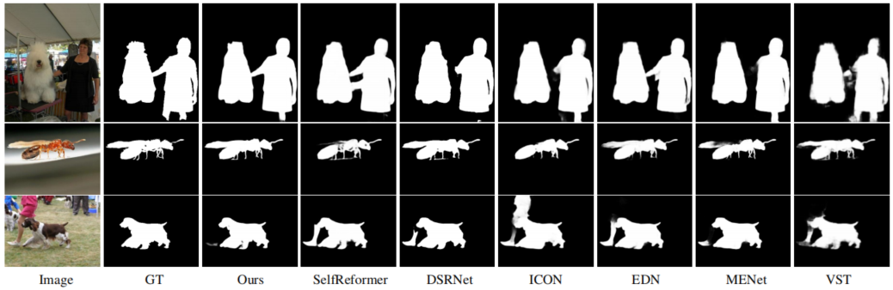
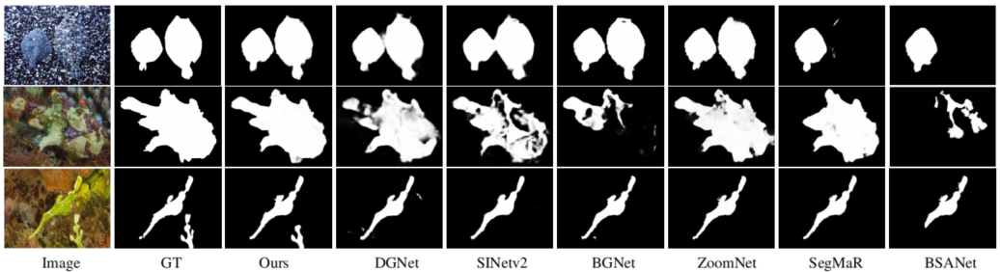

## MVGNet

### Comparison results

      
    <em> 
    Fig.1: Comparison of segmentation performance with other SOD models.
    </em>

      
    <em> 
    Fig.2: Comparison of segmentation performance with other COD models.
    </em>

### Dataset

+ downloading testing dataset and move it into `./Dataset/TestDataset/`, 
    which can be found in this [download link (Google Drive)](https://drive.google.com/file/d/1SLRB5Wg1Hdy7CQ74s3mTQ3ChhjFRSFdZ/view?usp=sharing).
    
+ downloading training dataset and move it into `./Dataset/TrainDataset/`, 
    which can be found in this [download link (Google Drive)](https://drive.google.com/file/d/1Kifp7I0n9dlWKXXNIbN7kgyokoRY4Yz7/view?usp=sharing).

